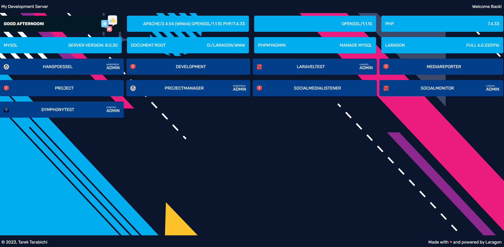

# Laragon Server Index Page

Welcome to the Laragon root directory index page! 
Attention developers! Are you tired of sifting through a cluttered directory to find your projects and files? Look no further than our customized user interface designed specifically for your Laragon server.

# Welcome to the Laragon root directory index page!

Our UI automatically detects any projects and directories within your root directory, making it easy to manage your work. Plus, we've included an automated auto-detection for popular frameworks like WordPress, Laravel, and Symfony.

We've gone the extra mile to provide a visually appealing and intuitive interface that's easy to navigate, so you can spend more time coding and less time searching for files. And with a responsive design, you can access our UI on any device.

To use our index page, simply replace the default index.php file in your Laragon root directory with our customized index.php file. And don't worry, we've taken care of cleaning up all PHP calls, providing error responses, and removing redundant codes.

This is good enough to be the official index page of Laragon to replace the vanilla Laragon server index page, and offers several key features that make it an essential tool for developers:

**

# Features
Our index page replaces the vanilla Laragon server index page, and offers several key features that make it an essential tool for developers:

**Visually appealing interface:** Our index page provides a clean and modern design that is both easy on the eyes and easy to navigate.

**Intuitive project management:** With our UI, you can quickly navigate through your projects and directories, making it easy to find the files you need and manage your server more effectively.

**Responsive design:** Our index page is designed to work seamlessly on any device, from desktop computers to mobile phones.

**

# How to Use
1. To use our index page, simply replace the default index.php file in your Laragon root directory with our customized index.php file. Once you've done that, you'll be able to access our UI by navigating to the root directory of your Laragon server.
2. Make sure you change your development path (.local) - if you've named your path differently
3. Make sure to upload the icons and css files to the assets directory (or simply import it as is) 
4. Make sure to change the ignored directories or add the directories that you don't intend to expose publicly

**

# Feedback
We're confident that our Laragon root directory index page will enhance your development experience and streamline your workflow. Try it out today and let us know what you think!
Don't forget to star the project to stay up-to-date on future improvements, and please share your feedback with us. We're always looking for ways to make our index page even better for you.
